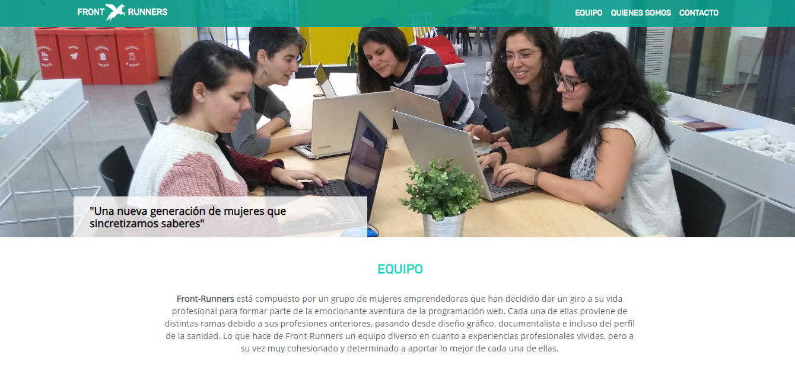

# Front-runners

Página web de presentación del equipo Front-runners con diseño responsive. Equipo de programadoras Front-end abordan su primer reto de programación en una web en la que se darán a conocer.

# Este es el resultado!💥

https://adharamonzon.github.io/Front-Runners/

## Objetivo 🎯

Este ejercicio es de la evaluación final del módulo de HTML y CSS, en él, el **objetivo** es crear una web de diseño responsive en el que aplicar todos los conocimientos de html, css, sass, git, git pages etc, en los que darons a conocer como programadoras

## Tecnologías utilizadas 💻

### HTML ✔

Para la estructura de la página web se ha utlizado HTML5, usando partials de html para un código más ordenado y legible, también se han utilizado etiquetas semánticas para mejorar la accesibilidad.

### CSS3 ✔

Para los estilos de la página web se ha utilizado CSS, usando el preprocesador de Sass

## Instalación del proyecto 🚀

Puedes clonarte el repositorio a través de este enlace, poniendo en la consola: **git clone https://github.com/adharamonzon/Front-Runners.git** y abrir el servidor.
